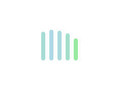

# CSS3 实现 8 种 Loading 效果

> 1. 第一种效果



代码如下：

```html
<div class="loading">
  <span></span>
  <span></span>
  <span></span>
  <span></span>
  <span></span>
</div>
```

```css
.loading {
  width: 80px;
  height: 40px;
  margin: 0 auto;
  margin-top: 100px;
}
.loading span {
  display: inline-block;
  width: 8px;
  height: 100%;
  background: lightgreen;
  border-radius: 4px;
  -webkit-animation: load 1.04s ease infinite;
}
@-webkit-keyframes load {
  0%,
  100% {
    height: 40px;
    background: lightgreen;
  }
  50% {
    height: 60px;
    margin-top: -20px;
    background: lightblue;
  }
}
.loading span:nth-child(2) {
  -webkit-animation-delay: 0.13s;
}
.loading span:nth-child(3) {
  -webkit-animation-delay: 0.26s;
}
.loading span:nth-child(4) {
  -webkit-animation-delay: 0.39s;
}
.loading span:nth-child(5) {
  -webkit-animation-delay: 0.52s;
}
```

> 2. 第二种效果


代码如下：

```html
<div class="loading">
  <span></span>
</div>
```

```css
.loading {
  position: relative;
  width: 80px;
  height: 80px;
  margin: 0 auto;
  margin-top: 100px;
  border: 5px solid lightgreen;
  border-radius: 50%;
  -webkit-animation: turn 2s linear infinite;
}
.loading span {
  position: absolute;
  left: 50%;
  display: inline-block;
  width: 30px;
  height: 30px;
  margin-top: -15px;
  margin-left: -15px;
  background: lightgreen;
  border-radius: 50%;
  -webkit-animation: changeBgColor 2s linear infinite;
}
@-webkit-keyframes changeBgColor {
  0% {
    background: lightgreen;
  }
  100% {
    background: lightblue;
  }
}
@-webkit-keyframes turn {
  0% {
    border-color: lightgreen;
    -webkit-transform: rotate(0deg);
  }
  100% {
    border-color: lightblue;
    -webkit-transform: rotate(360deg);
  }
}
```

> 3. 第三种效果


代码如下：

```html
<div class="loading">
  <span></span>
  <span></span>
  <span></span>
  <span></span>
  <span></span>
</div>
```

```css
.loading {
  width: 150px;
  height: 15px;
  margin: 0 auto;
  margin-top: 100px;
  text-align: center;
}
.loading span {
  display: inline-block;
  width: 15px;
  height: 100%;
  margin-right: 5px;
  background: lightgreen;
  -webkit-animation: load 1.04s ease infinite;
}
.loading span:last-child {
  margin-right: 0px;
}
@-webkit-keyframes load {
  0% {
    -webkit-transform: scale(1.2);
    opacity: 1;
  }
  100% {
    -webkit-transform: scale(0.2);
    opacity: 0.2;
  }
}
.loading span:nth-child(1) {
  -webkit-animation-delay: 0.13s;
}
.loading span:nth-child(2) {
  -webkit-animation-delay: 0.26s;
}
.loading span:nth-child(3) {
  -webkit-animation-delay: 0.39s;
}
.loading span:nth-child(4) {
  -webkit-animation-delay: 0.52s;
}
.loading span:nth-child(5) {
  -webkit-animation-delay: 0.65s;
}
```

> 4. 第四种效果


代码如下：

```html
<div class="loading">
  <span></span>
</div>
```

```css
.loading {
  position: relative;
  width: 150px;
  height: 8px;
  margin: 0 auto;
  margin-top: 100px;
  overflow: hidden;
  background: lightblue;
  border-radius: 4px;
}
.loading span {
  display: block;
  width: 100%;
  height: 100%;
  background: lightgreen;
  border-radius: 3px;
  -webkit-animation: changePosition 4s linear infinite;
}
@-webkit-keyframes changePosition {
  0% {
    -webkit-transform: translate(-150px);
  }
  50% {
    -webkit-transform: translate(0);
  }
  100% {
    -webkit-transform: translate(150px);
  }
}
```

> 5. 第五种效果


代码如下：

```html
<div class="loading">
  <span></span>
</div>
```

```css
.loading {
  position: relative;
  width: 200px;
  height: 60px;
  margin: 0 auto;
  margin-top: 100px;
}
.loading span {
  position: absolute;
  top: 50%;
  width: 50px;
  height: 30px;
  margin-top: -15px;
  overflow: hidden;
  background: lightgreen;
  border-radius: 50%;
  -webkit-animation: changePosition 2.08s linear infinite;
}
@-webkit-keyframes changePosition {
  0%,
  100% {
    -webkit-transform: translate(70px);
  }
  20% {
    width: 50px;
    height: 30px;
    margin-top: -15px;
    -webkit-transform: translate(0px);
  }
  30% {
    width: 20px;
    height: 60px;
    margin-top: -30px;
    -webkit-transform: translate(0px);
  }
  35% {
    width: 50px;
    height: 30px;
    margin-top: -15px;
    background: lightblue;
    -webkit-transform: translate(5px);
  }
  70% {
    width: 50px;
    height: 30px;
    margin-top: -15px;
    -webkit-transform: translate(160px);
  }
  80% {
    width: 20px;
    height: 60px;
    margin-top: -30px;
    -webkit-transform: translate(160px);
  }
  85% {
    width: 50px;
    height: 30px;
    margin-top: -15px;
    background: lightgreen;
    -webkit-transform: translate(155px);
  }
}
```

> 6. 第六种效果


代码如下：

```html
<div class="loadEffect">
  <span></span>
  <span></span>
  <span></span>
  <span></span>
  <span></span>
  <span></span>
  <span></span>
  <span></span>
</div>
```

```css
.loadEffect {
  position: relative;
  width: 100px;
  height: 100px;
  margin: 0 auto;
  margin-top: 100px;
}
.loadEffect span {
  position: absolute;
  display: inline-block;
  width: 30px;
  height: 10px;
  background: lightgreen;
  border-top-left-radius: 5px;
  border-bottom-left-radius: 5px;
  -webkit-animation: load 1.04s ease infinite;
}
@-webkit-keyframes load {
  0% {
    opacity: 1;
  }
  100% {
    opacity: 0.2;
  }
}
.loadEffect span:nth-child(1) {
  top: 50%;
  left: 0;
  margin-top: -5px;
  -webkit-animation-delay: 0.13s;
}
.loadEffect span:nth-child(2) {
  top: 20px;
  left: 10px;
  -webkit-transform: rotate(45deg);
  -webkit-animation-delay: 0.26s;
}
.loadEffect span:nth-child(3) {
  top: 10px;
  left: 50%;
  margin-left: -15px;
  -webkit-transform: rotate(90deg);
  -webkit-animation-delay: 0.39s;
}
.loadEffect span:nth-child(4) {
  top: 20px;
  right: 10px;
  -webkit-transform: rotate(135deg);
  -webkit-animation-delay: 0.52s;
}
.loadEffect span:nth-child(5) {
  top: 50%;
  right: 0;
  margin-top: -5px;
  -webkit-transform: rotate(180deg);
  -webkit-animation-delay: 0.65s;
}
.loadEffect span:nth-child(6) {
  right: 10px;
  bottom: 20px;
  -webkit-transform: rotate(225deg);
  -webkit-animation-delay: 0.78s;
}
.loadEffect span:nth-child(7) {
  bottom: 10px;
  left: 50%;
  margin-left: -15px;
  -webkit-transform: rotate(270deg);
  -webkit-animation-delay: 0.91s;
}
.loadEffect span:nth-child(8) {
  bottom: 20px;
  left: 10px;
  -webkit-transform: rotate(315deg);
  -webkit-animation-delay: 1.04s;
}
```

> 7. 第七种效果


代码如下：

```html
<div class="loadEffect">
  <div><span></span></div>
  <div><span></span></div>
  <div><span></span></div>
  <div><span></span></div>
</div>
```

```css
.loadEffect {
  position: relative;
  width: 100px;
  height: 100px;
  margin: 0 auto;
  margin-top: 100px;
}
.loadEffect div {
  position: absolute;
  width: 100%;
  height: 100%;
  -webkit-animation: load 2.08s linear infinite;
}
.loadEffect div span {
  position: absolute;
  left: 50%;
  display: inline-block;
  width: 20px;
  height: 20px;
  margin-top: -10px;
  margin-left: -10px;
  background: lightgreen;
  border-radius: 50%;
}
@-webkit-keyframes load {
  0% {
    -webkit-transform: rotate(0deg);
  }
  10% {
    -webkit-transform: rotate(45deg);
  }
  50% {
    -webkit-transform: rotate(160deg);
    opacity: 1;
  }
  62% {
    opacity: 0;
  }
  65% {
    -webkit-transform: rotate(200deg);
    opacity: 0;
  }
  90% {
    -webkit-transform: rotate(340deg);
  }
  100% {
    -webkit-transform: rotate(360deg);
  }
}
.loadEffect div:nth-child(1) {
  -webkit-animation-delay: 0.2s;
}
.loadEffect div:nth-child(2) {
  -webkit-animation-delay: 0.4s;
}
.loadEffect div:nth-child(3) {
  -webkit-animation-delay: 0.6s;
}
.loadEffect div:nth-child(4) {
  -webkit-animation-delay: 0.8s;
}
```

> 8. 第八种效果


代码如下：

```html
<div class="loading">
  <div><span></span></div>
  <div><span></span></div>
  <div><span></span></div>
</div>
```

```css
.loading {
  position: relative;
  width: 60px;
  height: 60px;
  margin: 0 auto;
  margin-top: 100px;
  -webkit-animation: load 3s linear infinite;
}
.loading div {
  position: absolute;
  width: 100%;
  height: 100%;
}
.loading span {
  position: absolute;
  left: 50%;
  display: inline-block;
  width: 20px;
  height: 20px;
  margin-top: -10px;
  margin-left: -10px;
  background: #99cc66;
  border-radius: 50%;
  -webkit-animation: changeBgColor 3s ease infinite;
}
@-webkit-keyframes load {
  0% {
    -webkit-transform: rotate(0deg);
  }
  33.3% {
    -webkit-transform: rotate(120deg);
  }
  66.6% {
    -webkit-transform: rotate(240deg);
  }
  100% {
    -webkit-transform: rotate(360deg);
  }
}
@-webkit-keyframes changeBgColor {
  0%,
  100% {
    background: #99cc66;
  }
  33.3% {
    background: #ffff66;
  }
  66.6% {
    background: #ff6666;
  }
}
.loading div:nth-child(2) {
  -webkit-transform: rotate(120deg);
}
.loading div:nth-child(3) {
  -webkit-transform: rotate(240deg);
}
.loading div:nth-child(2) span {
  -webkit-animation-delay: 1s;
}
.loading div:nth-child(3) span {
  -webkit-animation-delay: 2s;
}
```
