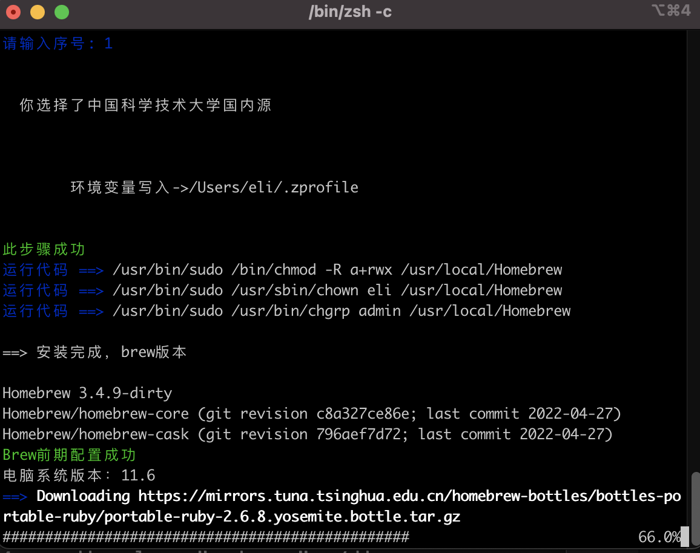

# MacOS 上快速下载安装 brew

Homebrew 官网：https://brew.sh/index_zh-cn

推荐大家使用国内镜像源，在 MacOS 上快速下载安装 brew

复制下面这段命令到终端，进入自动安装脚本步骤，选择国内镜像源编号

1. 中科大下载源（推荐）
2. 清华大学下载源
3. 北京外国语大学下载源
4. 腾讯下载源（不推荐）
5. 阿里巴巴下载源(不推荐 缺少 cask 源) 。

```bash
/bin/zsh -c "$(curl -fsSL https://gitee.com/cunkai/HomebrewCN/raw/master/Homebrew.sh)"
```



安装成功后出现如下：

```bash

        Brew自动安装程序运行完成
          国内地址已经配置完成

  桌面的Old_Homebrew文件夹，大致看看没有你需要的可以删除。

              初步介绍几个brew命令
本地软件库列表：brew ls
查找软件：brew search google（其中google替换为要查找的关键字）
查看brew版本：brew -v  更新brew版本：brew update
安装cask软件：brew install --cask firefox 把firefox换成你要安装的

        欢迎右键点击下方地址-打开URL 来给点个赞
         https://zhuanlan.zhihu.com/p/111014448

 安装成功 但还需要重启终端 或者 运行 source /Users/eli/.zprofile   否则可能无法使用
```

接下来运行

```bash
source /Users/eli/.zprofile
```
