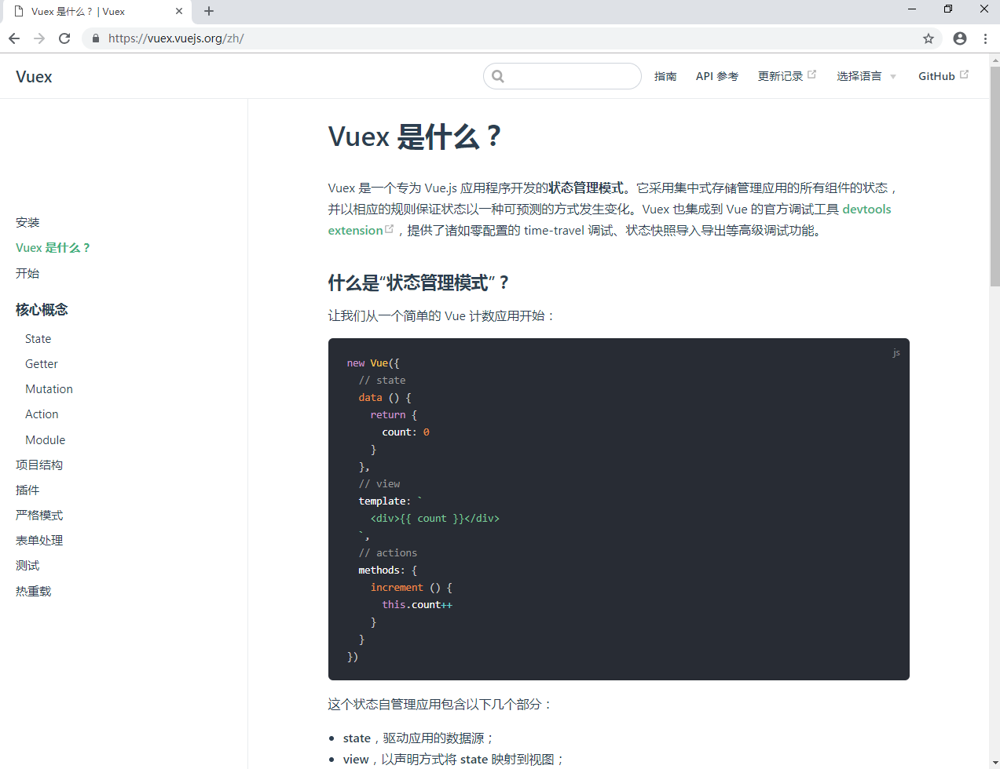

# Nuxt 使用 Vuex

> Vuex 是一个专为 Vue.js 应用程序开发的状态管理模式。它采用集中式存储管理应用的所有组件的状态，并以相应的规则保证状态以一种可预测的方式发生变化。

基础知识这里不再重述，学习的话请自行到官网学习 **[https://vuex.vuejs.org/zh/](https://vuex.vuejs.org/zh/)**

文档最后有具体使用的实例，不想看基础的就直接下调页面~ 

这里主要简单讲一讲 Nuxt 里怎么使用 vuex，

Nuxt.js 内置引用了 vuex 模块，所以不需要额外安装。

Nuxt.js 会尝试找到应用根目录下的 store 目录，如果该目录存在，它将做以下的事情：

1. 引用 vuex 模块
2. 将 vuex 模块 加到 vendors 构建配置中去
3. 设置 Vue 根实例的 store 配置项

Nuxt.js 支持两种使用 store 的方式，你可以择一使用：

- 普通方式： store/index.js 返回一个 Vuex.Store 实例
- 模块方式： store 目录下的每个 .js 文件会被转换成为状态树指定命名的子模块 （当然，index 是根模块）

**普通方式**

使用普通方式的状态树，需要添加 store/index.js 文件，并对外暴露一个 Vuex.Store 实例：

```
import Vue from 'vue'
import Vuex from 'vuex'

Vue.use(Vuex)

const store = () => new Vuex.Store({

  state: {
    counter: 0
  },
  mutations: {
    increment (state) {
      state.counter++
    }
  }
})

export default store
```

现在我们可以在组件里面通过 this.$store 来使用状态树

```
<template>
  　　<button @click="$store.commit('increment')">{{ $store.state.counter }}</button>
</template>
```

**模块方式**

状态树还可以拆分成为模块，store 目录下的每个 .js 文件会被转换成为状态树指定命名的子模块

### 使用状态树模块化的方式，store/index.js 不需要返回 Vuex.Store 实例，而应该直接将 state、mutations 和 actions 暴露出来：

```
export const state = () => ({
  counter: 0
})

export const mutations = {
  increment (state) {
    state.counter++
  }
}
```

### 其他的模块文件也需要采用类似的方式，如 store/todos.js 文件：

```
export const state = () => ({
  list: []
})

export const mutations = {
  add (state, text) {
    state.list.push({
      text: text,
      done: false
    })
  },
  remove (state, { todo }) {
    state.list.splice(state.list.indexOf(todo), 1)
  },
  toggle (state, todo) {
    todo.done = !todo.done
  }
}
```

### 在页面组件 pages/todos.vue， 可以像下面这样使用 todos 模块：

```
<template>
  <ul>
    <li v-for="todo in todos">
      <input type="checkbox" :checked="todo.done" @change="toggle(todo)">
      <span :class="{ done: todo.done }">{{ todo.text }}</span>
    </li>
    <li><input placeholder="What needs to be done?" @keyup.enter="addTodo"></li>
  </ul>
</template>

<script>
import { mapMutations } from 'vuex'

export default {
  computed: {
    todos () { return this.$store.state.todos.list }
  },
  methods: {
    addTodo (e) {
      this.$store.commit('todos/add', e.target.value)
      e.target.value = ''
    },
    ...mapMutations({
      toggle: 'todos/toggle'
    })
  }
}
</script>

<style>
.done {
  text-decoration: line-through;
}
</style>
```

模块方法也适用于顶级定义，而无需在 store 目录中实现子目录

state 示例，您需要创建一个文件 store/state.js 并添加以下内容：

```
export default () => ({
  counter: 0
})
```

并且相应的 mutations 在文件 store/mutations.js 中：

```
export default {
  increment (state) {
    state.counter++
  }
}
```


模块文件

您可以将模块文件分解为单独的文件：state.js,actions.js,mutations.js 和 getters.js。如果您使用 index.js 来维护 state,getters,actions 和 mutations，同时具有单个单独的操作文件，那么仍然可以正确识别该文件。

项目结构

vuex 并不限制你的代码结构。但是，它规定了一些需要遵守的规则：

1. 应用层级的状态应该集中到单个 store 对象中。

2. 提交 mutation 是更改状态的唯一方法，并且这个过程是同步的。

3. 异步逻辑都应该封装到 action 里面。

只要你遵守以上规则，如何组织代码随你便。如果你的 store 文件太大，只需将 action、mutation 和 getter 分割到单独的文件。

对于大型应用，我们会希望把 Vuex 相关代码分割到模块中。下面是项目结构示例：

```
├── index.html
├── main.js
├── api
│   └── ... # 抽取出API请求
├── components
│   ├── App.vue
│   └── ...
└── store
    ├── index.js          # 我们组装模块并导出 store 的地方
    ├── actions.js        # 根级别的 action
    ├── mutations.js      # 根级别的 mutation
    └── modules
        ├── cart.js       # 购物车模块
        └── products.js   # 产品模块
```

<h2 style="color: red;">下面用实例说一下怎么使用</h2>

### 一、在 Nuxt 项目的 store 目录下新建一个 index.js 文件，这样项目就启用了 vuex

```
import Vue from 'vue'
import Vuex from 'vuex'

Vue.use(Vuex)

const store = () => new Vuex.Store({

  state: {
    counter: 0
  },
  mutations: {
    increment (state) {
      state.counter++
    }
  }
})

export default store
```

一般这个文件我们只作为 vuex 的入口文件，不在这里面写业务代码，其他的功能写在其他的 vuex 文件中，在 index 中导入一下即可

### 二、在 store 文件夹里再新建一个 filter.js 文件，在 index.js 中引入一下，这个文件来写我们的业务代码

filter.js 文件

```
const state = ({
  value: 'Hello World',
  list: [1, 2, 3, 4, 5]
});
const getters = {
  include: (state) => (val) => {
    return state.list.indexOf(val) > -1;
  }
  }
;
const mutations = {
  SET_VALUE(state, value) {
    state.value = value;
  }
};
const actions = {
  async getInfo({state, commit}, val) {
    commit('SET_VALUE', val);
  }
};

export default {
  namespaced: true,
  state,
  getters,
  actions,
  mutations
};
```

这个文件中输出时候的 namespaced 属性，如果为 true 时，使用这个文件的方法时，需要标注 namespace，不写或为 false 时，则可以直接使用，这里建议使用 namespaced，因为大型项目可能有很多复杂的业务，可能命名冲突，使用 namespaced 可以把方法区分开，避免很多问题

index.js 文件

```
import Vue from 'vue';
import Vuex from 'vuex';
import filter from './filter';

Vue.use(Vuex);

const store = () => new Vuex.Store({
  state: {
  },
  mutations: {
  },
  modules: {
    filter
  }
});

export default store
```

在 index.js 文件中 import 一下我们的 filter.js 文件，然后在 modules 中引入即可使用

### 三、在 vue 文件中使用 vuex

index.vue

```
<template>
  <section class="p-10">
    <h1> {{ value }} </h1>
    <h1> {{ result }} </h1>
    <el-button type="danger" @click="change">点击</el-button>
  </section>
</template>

<script>
  import { mapState, mapMutations, mapActions, mapGetters } from 'vuex';
export default {
  data() {
    return {
      result: false
    };
  },
  computed: {
    ...mapGetters('filter', [
      'include'
    ]),
    ...mapState({
      value: state => state.filter.value
    })
  },
  methods: {
    ...mapMutations('filter', [
      'SET_VALUE'
    ]),
    ...mapActions('filter', [
      'getInfo'
    ]),
    change() {
      // this.result = this.include(1);
      // this.getInfo('你好');
      // this.SET_VALUE('HELLO');
    }
  },
  mounted() {
  },
  beforeDestroy() {
  }
};
</script>
```

1. 在 vue 文件中，首先通过 import { mapState, mapMutations, mapActions, mapGetters } from 'vuex' 来引入我们需要的模块，按需引用，只需要引入本页面用到的模块即可

2. mapGetters 和 mapState 需要在页面的计算属性 computed 中引入， mapMutations 和 mapActions 需要在 methods 中引入，此时要注意模块的命名空间，如果 vuex 文件导出时标注了 namespaced，我们使用时也需要写出才可以找到，反之则不需要

3. 首先是 mapState，使用 mapState 时，我有两种方法来取，两种方式都可以，这个方法是从 store 中取出这个变量，然后显示在此页面上，store 变动的话，此页面也会跟着动态改变

```
...mapState({
      value: state => state.filter.value
    })
```

```
...mapState('filter', {
      value: state => state.value
    })
```

4. mapGetters 类似于 store 的计算属性，我们可以通过 mapGetters 的方法在 store 里进行计算，然后返回我们需要的结果即可

上面例子就是点击按钮的时候传了一个数字到 store 里，然后判断 store 里的 list 是否包含这个数字，然后返回结果到页面，页面根据返回值重新刷新数据

5. MapMutation 是更改 store 中状态的唯一方法，Vuex 中的 mutation 非常类似于事件：每个 mutation 都有一个字符串的 事件类型 (type) 和 一个 回调函数 (handler)。这个回调函数就是我们实际进行状态更改的地方，并且它会接受 state 作为第一个参数

上面的例子是点击按钮时，直接通过 mutation 的方法修改了 store 里的数据，然后把数据同步到页面

6. mapAction 类似于 mutation， 但是 Action 提交的是 mutation，而不是直接变更状态，Action 可以包含任意异步操作，我们一般把异步获取数据的方法都放在这里，然后在回调函数里使用 mutation 里的方法把异步获取的数据保存在 store 里，然后把 store 里的数据传到页面

上面的例子是点击按钮时调用了 action 里的异步方法，然后在方法的回调函数里修改了 store 的数据，一般这里是把请求的结果进行保存，这里是省略了请求 API 方法
