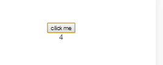
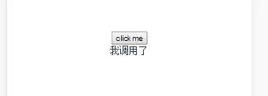
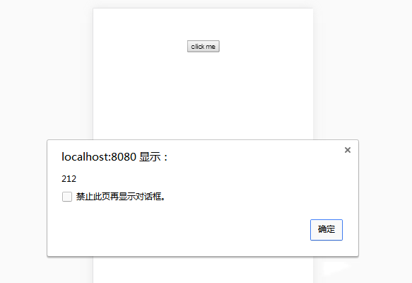
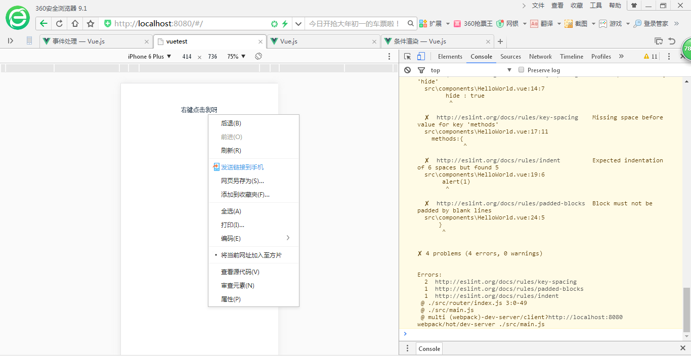

# v-onclick

## vue 常用事件之 v-on:click 以及事件对象，事件冒泡，事件默认行为

其实 v-on 后面跟的不止是 click 事件也可以是其他的事件，用法均相似。比如：v-on:click/mouseout/mouseover/mousedown.......

以下 click 为例

注意：所有的 v-on 都可以简写为@，比如说 v-click 可以简写为@click

- 1.监听事件可以用  `v-on`  指令监听 DOM 事件，并在触发时运行一些 JavaScript 代码。通常来讲就是监听 dom 触发一些操作，这些操作（比如点击）触发后执行的动作（js）可有直接写在后面

```
v-on:click="item+=1"
```

eg:

```
<template>
  <div >
   <input type="button" value="clickme" v-on:click="item+=1"/>
    <div>{{item}}</div>
  </div>
</template>

<script>
export default {
  name: 'HelloWorld',
  data () {
    return {
    item:1
    }
  }
}
</script>

<!-- Add "scoped" attribute to limit CSS to this component only -->
<style scoped>

</style>
```

结果：



可以看见每点击一次绑定的值就增加 1.也就是说可以吧 js 的操作放在事件触发的后面。但是有时候逻辑太复杂的时候写在里面就会造成混乱，视图和逻辑混淆。所以 click 后面可以接一个方法，把所有处理逻辑的方法封装在一个函数里面 click 的时候调用

- 2.事件处理方法

```
v-on:click="greet"
```

eg;

```
<template>
  <div >
   <input type="button" value="clickme" v-on:click="greet"/>
    <div>{{res}}</div>
  </div>
</template>

<script>
export default {
  name: 'HelloWorld',
  data () {
    return {
      name : 1,
      res:""
    }
  },
  methods:{
    greet: function () {
      // `this` 在方法里指向当前 Vue 实例
      this.res='Hello ' + this.name + '!';
    }
  }
}
</script>

<!-- Add "scoped" attribute to limit CSS to this component only -->
<style scoped>

</style>
```

效果：


可以看见点击之后执行了 greet 方法里面 js 逻辑

- 3.带参数的时间绑定方法：同上，唯一区别是携带了参数

```
 v-on:click="greet(name)"
```

```
<template>
  <div >
   <input type="button" value="clickme" v-on:click="greet(name)"/>
    <div>{{res}}</div>
  </div>
</template>

<script>
export default {
  name: 'HelloWorld',
  data () {
    return {
      name : 1,
      res:""
    }
  },
  methods:{
    greet: function (reccept) {
      // `this` 在方法里指向当前 Vue 实例
      this.res='Hello ' + reccept+1 + '!';
    }
  }
}
</script>

<!-- Add "scoped" attribute to limit CSS to this component only -->
<style scoped>

</style>
```

效果一致。对方法的调用同样可以一个方法多处多次的调用

- 4.内联处理器中的方法也就是说在方法里面调用其他的方法,这里的其他方法可以是 js 原生的方法比如阻止冒泡呀等等，也可以是自定义的方法

```
v-on:click="greet(name,$event)"
```

eg:

```
<template>
  <div >
   <input type="button" value="clickme" v-on:click="greet(name,$event)"/>
    <div>{{res}}</div>
  </div>
</template>

<script>
export default {
  name: 'HelloWorld',
  data () {
    return {
      name : 1,
      res:""
    }
  },
  methods:{
    greet: function (reccept,event) {
      if (reccept===1) this.say()
    },
    say:function () {
      this.res="我调用了"
    }
  }
}
</script>

<!-- Add "scoped" attribute to limit CSS to this component only -->
<style scoped>

</style>
```

效果：



- 5.事件对象 $event 拿到当前点击事件的事件对象，比如 click 就是拿到当前点击的 dom 事件对象信息

```
v-on:click="greet($event)"
```

eg:

```
<template>
  <div >
   <input type="button" value="clickme" v-on:click="greet($event)"/>
  </div>
</template>

<script>
export default {
  name: 'HelloWorld',
  data () {
    return {
      hide : true
    }
  },
  methods:{
    greet: function (ev) {
    alert(ev.clientX)
    }
  }
}
</script>

<!-- Add "scoped" attribute to limit CSS to this component only -->
<style scoped>

</style>
```

效果：



- 6.事件冒泡当不阻止事件冒泡的时候会弹两次

eg

```
<template>
  <div >
    <div @click="show1($event)">
      <div @click="show2($event)">点击我呀</div>
    </div>
  </div>
</template>

<script>
export default {
  name: 'HelloWorld',
  data () {
    return {
      hide : true
    }
  },
  methods:{
    show1: function (ev) {
     alert(1)
    },
    show2: function (ev1) {
      alert(2)
    }
  }
}
</script>

<!-- Add "scoped" attribute to limit CSS to this component only -->
<style scoped>

</style>
```

那么但阻止冒泡后就只会弹一次

eg:原生 js 阻止冒泡

```
    ev1.cancelBubble=true
```

```
<template>
  <div >
    <div @click="show1($event)">
      <div @click="show2($event)">点击我呀</div>
    </div>
  </div>
</template>

<script>
export default {
  name: 'HelloWorld',
  data () {
    return {
      hide : true
    }
  },
  methods:{
    show1: function (ev) {
     alert(1)
    },
    show2: function (ev1) {
        ev1.cancelBubble=true
      alert(2)

    }
  }
}
</script>

<!-- Add "scoped" attribute to limit CSS to this component only -->
<style scoped>

</style>
```

那么 vue 自己封装的阻止冒泡方法呢？

```
@click.stop="show2()"
eg:
<template>
  <div >
    <div @click="show1()">
      <div @click.stop="show2()">点击我呀</div>
    </div>
  </div>
</template>

<script>
export default {
  name: 'HelloWorld',
  data () {
    return {
      hide : true
    }
  },
  methods:{
    show1: function () {
     alert(1)
    },
    show2: function (ev1) {
      alert(2)
    }
  }
}
</script>

<!-- Add "scoped" attribute to limit CSS to this component only -->
<style scoped>

</style>
```

- 7.阻止默认行为：比如：如下右键之后会将默认的菜单带出来

```
<template>
  <div >
    <div>
      <div @contextmenu="show2()">右键点击我呀</div>
    </div>
  </div>
</template>

<script>
export default {
  name: 'HelloWorld',
  data () {
    return {
      hide : true
    }
  },
  methods:{
    show2: function (ev1) {
      alert(2)

    }
  }
}
</script>

<!-- Add "scoped" attribute to limit CSS to this component only -->
<style scoped>

</style>
```

效果：



那么就有了阻止默认行为

```
 ev1.preventDefault();
```

eg:

```
<template>
  <div >
    <div>
      <div @contextmenu="show2($event)">右键点击我呀</div>
    </div>
  </div>
</template>

<script>
export default {
  name: 'HelloWorld',
  data () {
    return {
      hide : true
    }
  },
  methods:{
    show2: function (ev1) {
      alert(2);
      ev1.preventDefault();
    }
  }
}
</script>

<!-- Add "scoped" attribute to limit CSS to this component only -->
<style scoped>

</style>
```

点击后默认菜单将不会显示（PS 早 360 浏览器右键无效） vue 里面的封装的阻止默认行为的方法：

```
@contextmenu.prevent="show2()"
```

eg:

```
<template>
  <div >
    <div>
      <div @contextmenu.prevent="show2()">右键点击我呀</div>
    </div>
  </div>
</template>

<script>
export default {
  name: 'HelloWorld',
  data () {
    return {
      hide : true
    }
  },
  methods:{
    show2: function (ev1) {
      alert(2);
    }
  }
}
</script>

<!-- Add "scoped" attribute to limit CSS to this component only -->
<style scoped>

</style>
```

- 8.其他事件修饰符

用法都一样就不再赘述

- .capture
- .self
- .once

```
<!-- 阻止单击事件继续传播 -->
<a v-on:click.stop="doThis"></a>

<!-- 提交事件不再重载页面 -->
<form v-on:submit.prevent="onSubmit"></form>

<!-- 修饰符可以串联 -->
<a v-on:click.stop.prevent="doThat"></a>

<!-- 只有修饰符 -->
<form v-on:submit.prevent></form>

<!-- 添加事件监听器时使用事件捕获模式 -->
<!-- 即元素自身触发的事件先在此处处理，然后才交由内部元素进行处理 -->
<div v-on:click.capture="doThis">...</div>

<!-- 只当在 event.target 是当前元素自身时触发处理函数 -->
<!-- 即事件不是从内部元素触发的 -->
<div v-on:click.self="doThat">...</div>
```

使用修饰符时，顺序很重要；相应的代码会以同样的顺序产生。因此，用  @click.prevent.self  会阻止所有的点击，而  @click.self.prevent  只会阻止对元素自身的点击。

> 2.1.4 新增

```
<!-- 点击事件将只会触发一次 -->
<a v-on:click.once="doThis"></a>
```

不像其它只能对原生的 DOM 事件起作用的修饰符，.once  修饰符还能被用到自定义的组件事件上。如果你还没有阅读关于组件的文档，现在大可不必担心。

```
<!-- the scroll event will not cancel the default scroll behavior -->
<div v-on:scroll.passive="onScroll">...</div>
```

Vue 为这些修饰符额外提供了  .passive  修饰符来提升移动端的性能。举个例子，在滚动的时候，浏览器会在整个事件处理完毕之后再触发滚动，因为浏览器并不知道这个事件是否在其处理函数中被调用了  event.preventDefault()。.passive  修饰符用来进一步告诉浏览器这个事件的默认行为不会被取消。

> 不要把  .passive  和  .prevent  一起使用。被动处理函数无法阻止默认的事件行为。
