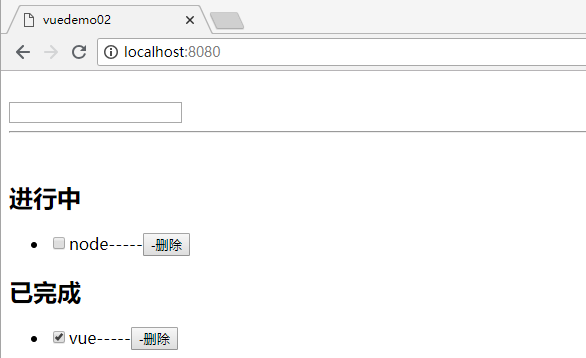
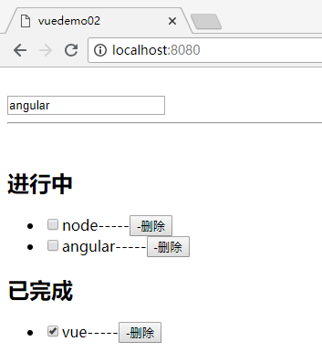

# 封装 Storage 组件实现保存搜索的历史记录

## Vue 模块化，封装 Storage 组件实现保存搜索的历史记录

### 1.使用 Storage 缓存页面数据

刷新页面后，之前操作的重要数据可以缓存到内存中，下次可以直接显示或者是使用

将数据进行缓存：`localStorage.setItem("list",JSON.stringify(this.list));`

将缓存数据取出：`var list=JSON.parse(localStorage.getItem("list"));`

生命周期函数：

```
mounted(){ /*生命周期函数， vue页面刷新就会触发的方法*/
    var list=JSON.parse(localStorage.getItem("list"));
      if (list){
      this.list = list;
    }
```

```
<template>
  <div id="app">

    <br>
    <input type="text" v-model='todo' @keydown="doAdd($event)">
    <br>
    <hr>
    <br>
    <h2>进行中</h2>
    <ul>
      <li v-for="(item ,key) in list" v-if="!item.checked">
        <input type="checkbox"  v-model="item.checked" @change="saveData()"/>{{item.title}}-----<button @click="removeData(key)">-删除</button>
      </li>
    </ul>
    <h2>已完成</h2>
    <ul>
      <li v-for="(item ,key) in list" v-if="item.checked">
        <input type="checkbox" v-model="item.checked" @change="saveData()"/>{{item.title}}-----<button @click="removeData(key)">-删除</button>
      </li>
    </ul>
  </div>
</template>

<script>
export default {
  name: 'app',
  data () {
    return {
      todo:"",
      list:[ ],
    }
  },methods:{
    doAdd(e){
      if(e.keyCode == 13){
        this.list.push({
          title:this.todo,
          checked:false
        });
      }
    localStorage.setItem("list",JSON.stringify(this.list));
    },
    removeData(key){
      this.list.splice(key,1);
      localStorage.setItem("list",JSON.stringify(this.list));
    },
    saveData(){
      localStorage.setItem("list",JSON.stringify(this.list));
    }
  },mounted(){ /*生命周期函数， vue页面刷新就会触发的方法*/
    var list=JSON.parse(localStorage.getItem("list"));
    if (list){
      this.list = list;
    }
  }
}
</script>

<style lang="scss">
</style>
```



### 2.封装 Storage 组件和使用

序列化对象：`JSON.stringify()`;

对象反序列化：`JSON.parse()`;

- 创建组件 `...\vuedemo02\src\model\storage.js`

```
/* 封装操作localstorage本地存储的方法，模块化的文件 */
var storage ={
  set(key, value){
    localStorage.setItem(key,JSON.stringify(value));
  },
  get(key){
    return JSON.parse(localStorage.getItem(key));
  },
  remove(key){
    localStorage.removeItem(key);
  }
};

export default storage;
```

- 在 vue 中调用

```
import storage from "./model/storage.js";

storage.set("list",this.list);

<template>
  <div id="app">

    <br>
    <input type="text" v-model='todo' @keydown="doAdd($event)">
    <br>
    <hr>
    <br>
    <h2>进行中</h2>
    <ul>
      <li v-for="(item ,key) in list" v-if="!item.checked">
        <input type="checkbox"  v-model="item.checked" @change="saveData()"/>{{item.title}}-----<button @click="removeData(key)">-删除</button>
      </li>
    </ul>
    <h2>已完成</h2>
    <ul>
      <li v-for="(item ,key) in list" v-if="item.checked">
        <input type="checkbox" v-model="item.checked" @change="saveData()"/>{{item.title}}-----<button @click="removeData(key)">-删除</button>
      </li>
    </ul>
  </div>
</template>

<script>
  import storage from "./model/storage.js";
export default {
  name: 'app',
  data () {
    return {
      todo:"",
      list:[ ],
    }
  },methods:{
    doAdd(e){
      if(e.keyCode == 13){
        this.list.push({
          title:this.todo,
          checked:false
        });
      }
    storage.set("list",this.list);
    },
    removeData(key){
      this.list.splice(key,1);
      storage.set("list",this.list);
    },
    saveData(){
      storage.set("list",this.list);
    }
  },mounted(){ /*生命周期函数， vue页面刷新就会触发的方法*/
    var list=storage.get("list");
    if (list){
      this.list = list;
    }
  }
}
</script>

<style lang="scss">
</style>
```


