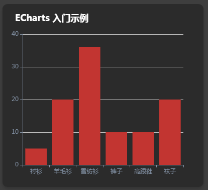

# react 之引用 echarts

下载：

```
npm install echarts --save
// 或
yarn add echarts
```

**demo1 代码：**

```js
import React, { Component } from 'react';

// 引入 ECharts 主模块
import echarts from 'echarts/lib/echarts';
// 引入柱状图
import 'echarts/lib/chart/bar';
// 引入提示框和标题组件
import 'echarts/lib/component/tooltip';
import 'echarts/lib/component/title';

class EchartsTest extends Component {
  componentDidMount() {
    // 基于准备好的dom，初始化echarts实例
    var myChart = echarts.init(document.getElementById('main'));
    // 绘制图表
    myChart.setOption({
      title: {
        text: 'ECharts 入门示例',
        top: 15,
        left: 20,
        textStyle: {
          color: '#fff',
        },
      },
      tooltip: {},
      xAxis: {
        data: ['衬衫', '羊毛衫', '雪纺衫', '裤子', '高跟鞋', '袜子'],
        axisLine: { lineStyle: { color: '#8392A5' } },
      },
      yAxis: {
        axisLine: { lineStyle: { color: '#8392A5' } },
      },
      series: [
        {
          name: '销量',
          type: 'bar',
          data: [5, 20, 36, 10, 10, 20],
        },
      ],
    });
  }
  render() {
    return <div id="main" style={{ width: 400, height: 400 }}></div>;
  }
}

export default EchartsTest;
```

demo1 效果图： 

<hr/>
**demo2代码：**
```js
import React, { Component } from 'react';

// 引入 ECharts 主模块 import echarts from 'echarts/lib/echarts'; //导入折线图 import 'echarts/lib/chart/line'; //折线图是 line,饼图改为 pie,柱形图改为 bar

// 引入提示框和标题组件 import 'echarts/lib/component/tooltip'; import 'echarts/lib/component/title';

// x 轴拖动 // import 'echarts/lib/component/dataZoom'; // import 'echarts/lib/component/dataZoomSelect'; import 'echarts/lib/component/dataZoomInside'; import 'echarts/lib/component/dataZoomSlider';

// 图例组件 import 'echarts/lib/component/legend';

// 图表标注 import 'echarts/lib/component/markPoint';

class EchartsTest extends Component { componentDidMount() { // 基于准备好的 dom，初始化 echarts 实例 var myChart = echarts.init(document.getElementById('main')); var rawData = [ ['2016/1/1','3520','3588','嗯嗯','10%','哈哈哈哈哈哈哈哈哈哈哈哈哈哈哈','鱼鱼鱼','嗷嗷嗷','热热热','拜拜'], ['2016/1/2','3620','3788','嗯嗯','10%','哈哈哈哈哈哈哈哈哈哈哈哈哈哈哈','鱼鱼鱼','嗷嗷嗷','热热热','拜拜'], ['2016/1/3','3720','3688','嗯嗯','10%','哈哈哈哈哈哈哈哈哈哈哈哈哈哈哈','鱼鱼鱼','嗷嗷嗷','热热热','拜拜'], ['2016/1/4','3820','3988','嗯嗯','10%','哈哈哈哈哈哈哈哈哈哈哈哈哈哈哈','鱼鱼鱼','嗷嗷嗷','热热热','拜拜'], ['2016/1/5','3420','4588','嗯嗯','10%','哈哈哈哈哈哈哈哈哈哈哈哈哈哈哈','鱼鱼鱼','嗷嗷嗷','热热热','拜拜'], ['2016/1/6','3520','3588','嗯嗯','10%','哈哈哈哈哈哈哈哈哈哈哈哈哈哈哈','鱼鱼鱼','嗷嗷嗷','热热热','拜拜'], ['2016/1/7','3220','3588','嗯嗯','10%','哈哈哈哈哈哈哈哈哈哈哈哈哈哈哈','鱼鱼鱼','嗷嗷嗷','热热热','拜拜'], ['2016/1/8','3540','3788','嗯嗯','10%','哈哈哈哈哈哈哈哈哈哈哈哈哈哈哈','鱼鱼鱼','嗷嗷嗷','热热热','拜拜'], ['2016/1/9','3570','5088','嗯嗯','10%','哈哈哈哈哈哈哈哈哈哈哈哈哈哈哈','鱼鱼鱼','嗷嗷嗷','热热热','拜拜'], ['2016/1/10','3820','4688','嗯嗯','10%','哈哈哈哈哈哈哈哈哈哈哈哈哈哈哈','鱼鱼鱼','嗷嗷嗷','热热热','拜拜'], ['2016/1/11','3920','6588','嗯嗯','10%','哈哈哈哈哈哈哈哈哈哈哈哈哈哈哈','鱼鱼鱼','嗷嗷嗷','热热热','拜拜'], ['2016/1/12','3520','3588','嗯嗯','10%','哈哈哈哈哈哈哈哈哈哈哈哈哈哈哈','鱼鱼鱼','嗷嗷嗷','热热热','拜拜'], ['2016/1/13','4520','4588','嗯嗯','10%','哈哈哈哈哈哈哈哈哈哈哈哈哈哈哈','鱼鱼鱼','嗷嗷嗷','热热热','拜拜'], ];

        var dates = rawData.map(function (item) {
            return item[0];
        });
        var date1 = rawData.map(function (item) {
            return item[1];
        });
        var date2 = rawData.map(function (item) {
            return item[2];
        });
        var date3 = rawData.map(function (item) {
            return item[6];
        });
        var date4 = rawData.map(function (item) {
            return item[4];
        });
        var date5 = rawData.map(function (item) {
            return item[5];
        });
        var data = rawData.map(function (item) {
          return [+item[1], +item[2], +item[5], +item[6]];
        });

        // 绘制图表
        myChart.setOption({
          backgroundColor: 'rgba(43,43,43,1)',
          legend: {
              data: ['时间', '幅度', '卖出价格', '原始价格', '移动原因', '详情'],
              inactiveColor: '#777',
              top: 20,
              right: 80,
              textStyle: {
                  color: '#fff'
              }
          },
          tooltip: {
              trigger: 'axis',
              axisPointer: {
                  animation: false,
                  type: 'cross',
                  lineStyle: {
                      color: '#376df4',
                      width: 2,
                      opacity: 1
                  }
              },
              formatter: function (param) {
                  // console.log('param--->',param)
                  // param = param[0];
                  return [
                      "<div style='padding:10px;font-size:12px;'>" +
                          "<p><span style='display:inline-block;width:60px;color:rgba(170,170,170,1);'>日期</span>" + param[0].name + "</p>",
                          "<p><span style='display:inline-block;width:60px;color:rgba(170,170,170,1);'>幅度</span>" + param[0].data + "</p>",
                          "<p><span style='display:inline-block;width:60px;color:rgba(170,170,170,1);'>卖出价格</span>" + param[1].data + "</p>",
                          "<p><span style='display:inline-block;width:60px;color:rgba(170,170,170,1);'>原始价格</span>" + param[2].data + "</p>",
                          "<p><span style='display:inline-block;width:60px;color:rgba(170,170,170,1);'>移动原因</span>" + param[3].data + "</p>",
                          "<p><span style='display:inline-block;width:60px;color:rgba(170,170,170,1);'>详情</span>" + param[4].data + "</p>"
                      + "</div>"
                  ].join('');
              }
          },
          xAxis: {
              type: 'category',
              data: dates,
              axisLine: { lineStyle: { color: '#8392A5' } }
          },
          yAxis: {
              scale: true,
              position:'right',
              axisLine: { lineStyle: { color: '#8392A5' } },
              splitLine: { show: false },

          },
          grid: {
              left: 20,
              bottom: 80
          },
          dataZoom: [{
              textStyle: {
                  color: '#8392A5'
              },
              handleIcon: 'M10.7,11.9v-1.3H9.3v1.3c-4.9,0.3-8.8,4.4-8.8,9.4c0,5,3.9,9.1,8.8,9.4v1.3h1.3v-1.3c4.9-0.3,8.8-4.4,8.8-9.4C19.5,16.3,15.6,12.2,10.7,11.9z M13.3,24.4H6.7V23h6.6V24.4z M13.3,19.6H6.7v-1.4h6.6V19.6z',
              handleSize: '80%',
              dataBackground: {
                  areaStyle: {
                      color: '#8392A5',
                  },
                  lineStyle: {
                      opacity: 0.8,
                      color: '#8392A5'
                  }
              },
              handleStyle: {
                  color: '#fff',
                  shadowBlur: 3,
                  shadowColor: 'rgba(0, 0, 0, 0.6)',
                  shadowOffsetX: 2,
                  shadowOffsetY: 2
              }
          },
          {
              type: 'inside',
          }],
          animation: false,
          series: [
              /*
              {
                  type: 'candlestick',
                  name: '日K',
                  data: data,
                  itemStyle: {
                      normal: {
                          color: '#FD1050',
                          color0: '#0CF49B',
                          borderColor: '#FD1050',
                          borderColor0: '#0CF49B'
                      }
                  }
              },
              */
              {
                  // name: '幅度',
                  type: 'line',
                  data: date4,
                  smooth: true,
                  showSymbol: false,
                  lineStyle: {
                      normal: {
                          width: 0
                      }
                  }
              },
              {
                  name: '卖出价格',
                  type: 'line',
                  data: date1,
                  smooth: true,
                  showSymbol: false,
                  color: '#CD5652', // 红色 图例颜色
                  lineStyle: {
                      normal: {
                          color: '#CD5652', // 红色
                          width: 1
                      }
                  }
              },
              {
                  name: '原始价格',
                  type: 'line',
                  data: date2,
                  smooth: true,
                  showSymbol: false,
                  color: '#4C9A76', // 绿色 图例颜色
                  lineStyle: {
                      normal: {
                          color: '#4C9A76', // 绿色
                          width: 1
                      }
                  }
              },
              {
                  // name: '移动原因',
                  type: 'line',
                  data: date3,
                  smooth: true,
                  showSymbol: false,
                  lineStyle: {
                      normal: {
                          width: 0
                      }
                  }
              },
              {
                  // name: '详情',
                  type: 'line',
                  data: date5,
                  smooth: true,
                  showSymbol: false,
                  lineStyle: {
                      normal: {
                          width: 0
                      }
                  }
              },
          ]
        });
    }
    render() {
        return (
            <div id="main"></div>
        );
    }

}

export default EchartsTest;

````
demo2效果图：


<hr/>

## echarts中datazoom 配置
```js
dataZoom=[                                      //区域缩放
    {
        id: 'dataZoomX',
        show:true,                              //是否显示 组件。如果设置为 false，不会显示，但是数据过滤的功能还存在。
        backgroundColor:"rgba(47,69,84,0)",  //组件的背景颜色
        type: 'slider',                         //slider表示有滑动块的，inside表示内置的
        dataBackground:{                        //数据阴影的样式。
            lineStyle:mylineStyle,              //阴影的线条样式
            areaStyle:myareaStyle,              //阴影的填充样式
        },
        fillerColor:"rgba(167,183,204,0.4)",  //选中范围的填充颜色。
        borderColor:"#ddd",                     //边框颜色。
        filterMode: 'filter',                   //'filter'：当前数据窗口外的数据，被 过滤掉。即 会 影响其他轴的数据范围。每个数据项，只要有一个维度在数据窗口外，整个数据项就会被过滤掉。
                                                  //'weakFilter'：当前数据窗口外的数据，被 过滤掉。即 会 影响其他轴的数据范围。每个数据项，只有当全部维度都在数据窗口同侧外部，整个数据项才会被过滤掉。
                                                  //'empty'：当前数据窗口外的数据，被 设置为空。即 不会 影响其他轴的数据范围。
                                                  //'none': 不过滤数据，只改变数轴范围。
        xAxisIndex:0,                            //设置 dataZoom-inside 组件控制的 x轴,可以用数组表示多个轴
        yAxisIndex:[0,2],                        //设置 dataZoom-inside 组件控制的 y轴,可以用数组表示多个轴
        radiusAxisIndex:3,                       //设置 dataZoom-inside 组件控制的 radius 轴,可以用数组表示多个轴
        angleAxisIndex:[0,2],                    //设置 dataZoom-inside 组件控制的 angle 轴,可以用数组表示多个轴
        start: 30,                                //数据窗口范围的起始百分比,表示30%
        end: 70,                                  //数据窗口范围的结束百分比,表示70%
        startValue:10,                           //数据窗口范围的起始数值
        endValue:100,                            //数据窗口范围的结束数值。
        orient:"horizontal",                    //布局方式是横还是竖。不仅是布局方式，对于直角坐标系而言，也决定了，缺省情况控制横向数轴还是纵向数轴。'horizontal'：水平。'vertical'：竖直。
        zoomLock:false,                          //是否锁定选择区域（或叫做数据窗口）的大小。如果设置为 true 则锁定选择区域的大小，也就是说，只能平移，不能缩放。
        throttle:100,                             //设置触发视图刷新的频率。单位为毫秒（ms）。
        zoomOnMouseWheel:true,                  //如何触发缩放。可选值为：true：表示不按任何功能键，鼠标滚轮能触发缩放。false：表示鼠标滚轮不能触发缩放。'shift'：表示按住 shift 和鼠标滚轮能触发缩放。'ctrl'：表示按住 ctrl 和鼠标滚轮能触发缩放。'alt'：表示按住 alt 和鼠标滚轮能触发缩放。
        moveOnMouseMove:true,                   //如何触发数据窗口平移。true：表示不按任何功能键，鼠标移动能触发数据窗口平移。false：表示鼠标滚轮不能触发缩放。'shift'：表示按住 shift 和鼠标移动能触发数据窗口平移。'ctrl'：表示按住 ctrl 和鼠标移动能触发数据窗口平移。'alt'：表示按住 alt 和鼠标移动能触发数据窗口平移。
        left:"center",                           //组件离容器左侧的距离,'left', 'center', 'right','20%'
        top:"top",                                //组件离容器上侧的距离,'top', 'middle', 'bottom','20%'
        right:"auto",                             //组件离容器右侧的距离,'20%'
        bottom:"auto",                            //组件离容器下侧的距离,'20%'

    },
    {
        id: 'dataZoomY',
        type: 'inside',
        filterMode: 'empty',
        disabled:false,                         //是否停止组件的功能。
        xAxisIndex:0,                           //设置 dataZoom-inside 组件控制的 x轴,可以用数组表示多个轴
        yAxisIndex:[0,2],                       //设置 dataZoom-inside 组件控制的 y轴,可以用数组表示多个轴
        radiusAxisIndex:3,                      //设置 dataZoom-inside 组件控制的 radius 轴,可以用数组表示多个轴
        angleAxisIndex:[0,2],                   //设置 dataZoom-inside 组件控制的 angle 轴,可以用数组表示多个轴
        start: 30,                               //数据窗口范围的起始百分比,表示30%
        end: 70,                                  //数据窗口范围的结束百分比,表示70%
        startValue:10,                           //数据窗口范围的起始数值
        endValue:100,                            //数据窗口范围的结束数值。
        orient:"horizontal",                    //布局方式是横还是竖。不仅是布局方式，对于直角坐标系而言，也决定了，缺省情况控制横向数轴还是纵向数轴。'horizontal'：水平。'vertical'：竖直。
        zoomLock:false,                          //是否锁定选择区域（或叫做数据窗口）的大小。如果设置为 true 则锁定选择区域的大小，也就是说，只能平移，不能缩放。
        throttle:100,                             //设置触发视图刷新的频率。单位为毫秒（ms）。
        zoomOnMouseWheel:true,                   //如何触发缩放。可选值为：true：表示不按任何功能键，鼠标滚轮能触发缩放。false：表示鼠标滚轮不能触发缩放。'shift'：表示按住 shift 和鼠标滚轮能触发缩放。'ctrl'：表示按住 ctrl 和鼠标滚轮能触发缩放。'alt'：表示按住 alt 和鼠标滚轮能触发缩放。
        moveOnMouseMove:true,                    //如何触发数据窗口平移。true：表示不按任何功能键，鼠标移动能触发数据窗口平移。false：表示鼠标滚轮不能触发缩放。'shift'：表示按住 shift 和鼠标移动能触发数据窗口平移。'ctrl'：表示按住 ctrl 和鼠标移动能触发数据窗口平移。'alt'：表示按住 alt 和鼠标移动能触发数据窗口平移。
    }
]
````

<hr/>

> 参考网址： [W3Cscool 如何快速上手 ECharts](https://www.w3cschool.cn/echarts_tutorial/echarts_tutorial-mec528xa.html)：[https://www.w3cschool.cn/echarts_tutorial/echarts_tutorial-mec528xa.html](https://www.w3cschool.cn/echarts_tutorial/echarts_tutorial-mec528xa.html) > [ECharts 官网](https://www.echartsjs.com/zh/option.html#title)：[https://www.echartsjs.com/zh/option.html#title](https://www.echartsjs.com/zh/option.html#title) > [动态加载数据](https://blog.csdn.net/hahahhahahahha123456/article/details/80390151)：[https://blog.csdn.net/hahahhahahahha123456/article/details/80390151](https://blog.csdn.net/hahahhahahahha123456/article/details/80390151) > [tradingview 使用心得（用于画 K 线）](https://blog.csdn.net/hnlgzb/article/details/88064230)：[https://blog.csdn.net/hnlgzb/article/details/88064230](https://blog.csdn.net/hnlgzb/article/details/88064230) > [TradingView + WebSocket 实时推送 K 线脱坑指南](https://blog.csdn.net/weixin_33859504/article/details/87952669)：[https://blog.csdn.net/weixin_33859504/article/details/87952669](https://blog.csdn.net/weixin_33859504/article/details/87952669) > []()：[]() > []()：[]()
