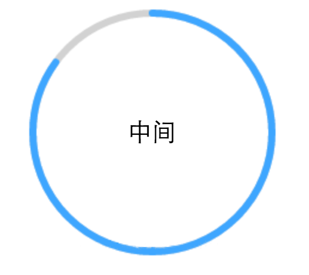

# 总结相关

## [微信小程序开发文档](https://developers.weixin.qq.com/miniprogram/dev/framework/)：[https://developers.weixin.qq.com/miniprogram/dev/framework/](https://developers.weixin.qq.com/miniprogram/dev/framework/)

1. [UI 框架 - iView Weapp](https://weapp.iviewui.com/docs/guide/start)：参考 [https://weapp.iviewui.com/docs/guide/start](https://weapp.iviewui.com/docs/guide/start)
2. [在微信小程序中使用 ECharts](https://github.com/ecomfe/echarts-for-weixin)：参考 [https://github.com/ecomfe/echarts-for-weixin](https://github.com/ecomfe/echarts-for-weixin)
3. [小程序 2 个页面如何接传值](https://blog.csdn.net/gaoqiang1112/article/details/77876826?utm_source=copy)：参考 [https://blog.csdn.net/gaoqiang1112/article/details/77876826?utm_source=copy](https://blog.csdn.net/gaoqiang1112/article/details/77876826?utm_source=copy)

**小程序通过全局变量实现两个页面之间数据传递（数组）**

> 首先需要在 app.js 中定义全局变量

```
//app.js
var list

App({

})
>
```

> 然后在 index 页面中同样也定义该变量 list，然后在 onShow 中获取全局变量的值（注意！要有 var app = getApp() ）

```
//index.js
var app = getApp()

Page({
	data: {
		list: []
	},
	onShow function() {
		var list = app.list;
		this.setData({
			list: list
		})
	}
})
```

> 在另外一个页面中定义全局变量 list 数组并赋值（注意！同样需要 var app = getApp() ）

```
//logs.js
var app = getApp()
app.list = [
	{ "id": 1, "name": "Tom" },
	{ "id": 2, "name": "Alice" },
	{ "id": 3, "name": "Jack" },
]

Page({
	data: {
		list: []
	}
})
```

> 这时在 index.xml 文件中就可以直接引用 list 的数据了

```
//index.xml

<view wx:for="{{list}}">
    <view>{{item.id}}</view>
	<view>{{item.name}}</view>
</view>
```

4. **微信小程序配置顶部导航条标题颜色**

```
{
  "window":{
    "navigationBarBackgroundColor": "#ffffff",
    "navigationBarTextStyle": "black",
    "navigationBarTitleText": "微信接口功能演示",
    "backgroundColor": "#eeeeee",
    "backgroundTextStyle": "light"
  }
}
```

```
navigationBarBackgroundColor 导航栏背景颜色，如”#000000”

navigationBarTextStyle 导航栏标题颜色，仅支持 black/white

navigationBarTitleText 导航栏标题文字内容

backgroundColor 窗口的背景色

backgroundTextStyle 下拉背景字体、loading 图的样式，仅支持 dark/light

enablePullDownRefresh 是否开启下拉刷新，详见页面相关事件处理函数。
```

5. **微信小程序——自定义圆形进度条**

如图所示： 

> **先绘制底层的灰色圆圈背景，再绘制上层的蓝色进度条。**

代码实现：

- JS 代码

```javascript
Page({
  data: {},
  onLoad: function (options) {
    // 页面初始化 options为页面跳转所带来的参数
  },
  onReady: function () {
    // 页面渲染完成
    var cxt_arc = wx.createCanvasContext('canvasArc'); //创建并返回绘图上下文context对象。
    cxt_arc.setLineWidth(6);
    cxt_arc.setStrokeStyle('#d2d2d2');
    cxt_arc.setLineCap('round');
    cxt_arc.beginPath(); //开始一个新的路径
    cxt_arc.arc(106, 106, 100, 0, 2 * Math.PI, false); //设置一个原点(106,106)，半径为100的圆的路径到当前路径
    cxt_arc.stroke(); //对当前路径进行描边

    cxt_arc.setLineWidth(6);
    cxt_arc.setStrokeStyle('#3ea6ff');
    cxt_arc.setLineCap('round');
    cxt_arc.beginPath(); //开始一个新的路径
    cxt_arc.arc(106, 106, 100, (-Math.PI * 1) / 2, (Math.PI * 6) / 5, false);
    cxt_arc.stroke(); //对当前路径进行描边

    cxt_arc.draw();
  },
  onShow: function () {
    // 页面显示
  },
  onHide: function () {
    // 页面隐藏
  },
  onUnload: function () {
    // 页面关闭
  },
});
```

- 页面布局

```wxml
<view class="wrap">
  <view class="top">
    <canvas class="cir" style="width:212px; height:212px;" canvas-id="canvasArc">
    </canvas>
    <view class="cc">中间</view>
  </view>
</view>
```

- CSS 样式

```css
.cir {
  display: inline-block;
  margin-top: 20rpx;
}
.top {
  text-align: center;
}
.cc {
  margin-top: -120px;
}
```

6. **小程序遇到的坑**

- 微信小程序行内写 parseInt()或 parseFloat()无效,只能写在 js 中。

**[WXML 数据绑定](https://developers.weixin.qq.com/miniprogram/dev/reference/wxml/data.html)：参考文档[https://developers.weixin.qq.com/miniprogram/dev/reference/wxml/data.html](https://developers.weixin.qq.com/miniprogram/dev/reference/wxml/data.html)**

- 微信小程序分包加载，整个小程序所有分包大小不超过 8M，单个分包/主包大小不能超过 2M

**[分包加载](https://developers.weixin.qq.com/miniprogram/dev/framework/subpackages.html)：参考文档[https://developers.weixin.qq.com/miniprogram/dev/framework/subpackages.html](https://developers.weixin.qq.com/miniprogram/dev/framework/subpackages.html)**

## [微信小程序开发资源汇总](https://github.com/justjavac/awesome-wechat-weapp)：[https://github.com/justjavac/awesome-wechat-weapp](https://github.com/justjavac/awesome-wechat-weapp)
